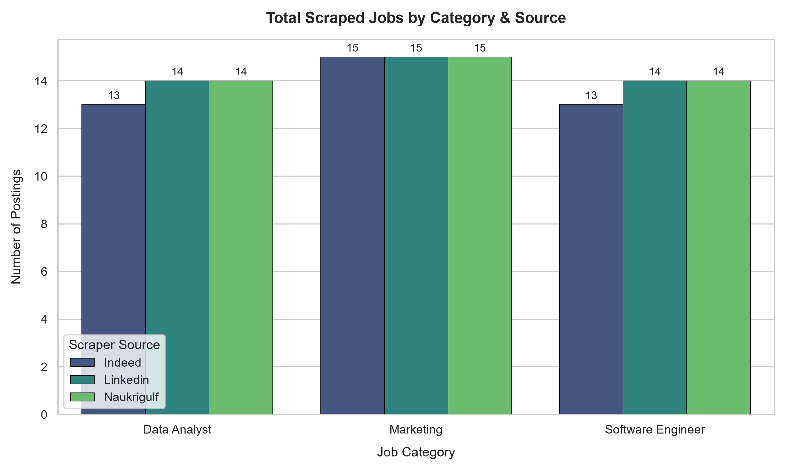
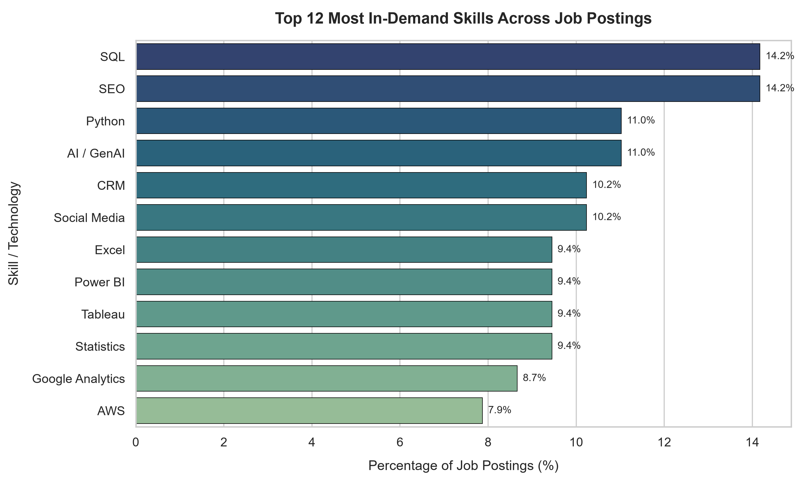
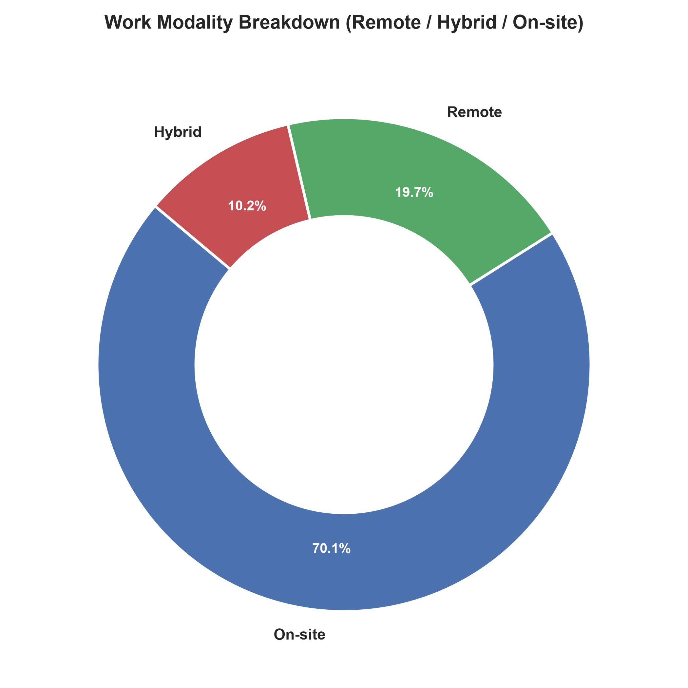
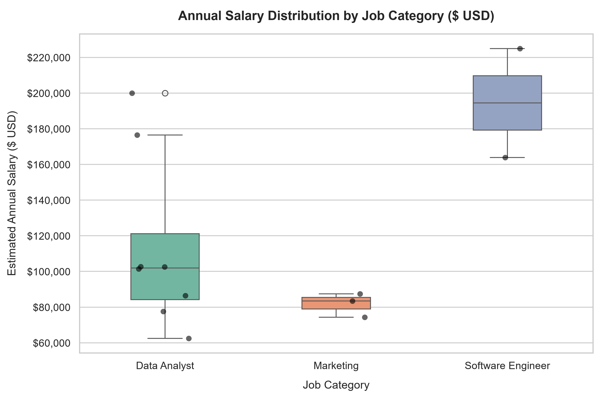
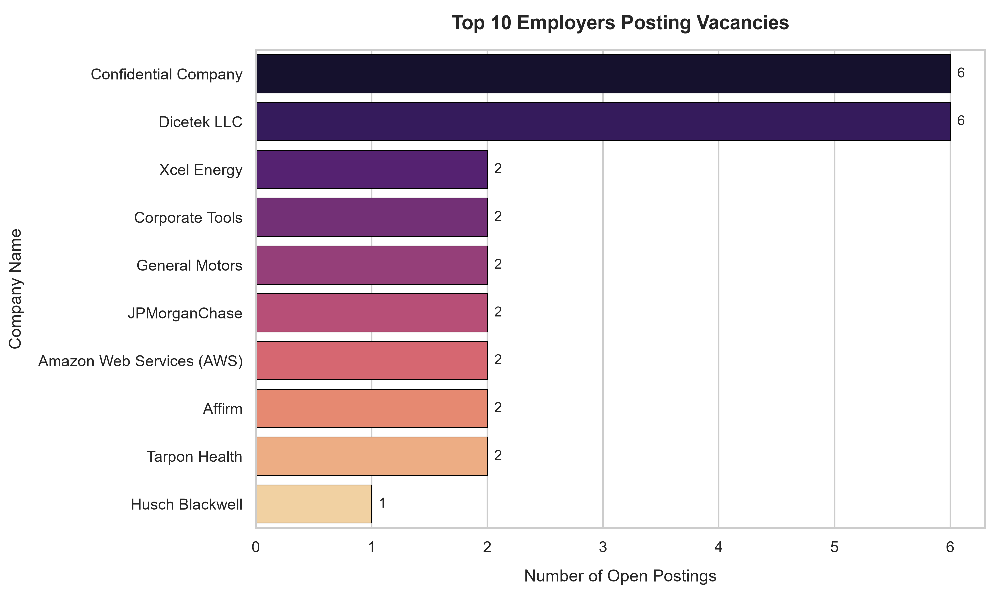

# Recruitment Data & Job Market Analytics Report

> **Automated Market Intelligence & Skills Analysis Report**  
> *Dataset Scope: 127 total postings across 3 job categories from 3 recruitment portals (Linkedin, Indeed, Naukrigulf).*

---

## 1. Executive Summary

This report analyzes recent job market vacancies collected across **LinkedIn**, **Indeed**, and **NaukriGulf** to identify core technical skill demands, work modality preferences, compensation trends, and top hiring organizations across three core domains: **Data Analysis**, **Software Engineering**, and **Digital Marketing**.

- **Total Jobs Analyzed**: 127 unique deduplicated records.
- **Top Overall In-Demand Technical Skill**: SQL (present in 14.2% of job descriptions).
- **Work Modality Breakdown**: 
  - **On-site**: 70.1% (89 postings)
  - **Remote**: 19.7% (25 postings)
  - **Hybrid**: 10.2% (13 postings)

---

## 2. Job Distribution & Portal Breakdown

Data was scraped and unified across **LinkedIn**, **Indeed**, and **NaukriGulf**. The volume of vacancies by domain and portal origin is displayed below:

---

## 3. Key Skills & Technology Stack Analysis

### Overall Top Skills Across All Categories

| Skill / Technology | Mention Count | % of All Jobs |
| :--- | :---: | :---: |
| **SQL** | 18 | 14.2% |
| **SEO** | 18 | 14.2% |
| **Python** | 14 | 11.0% |
| **AI / GenAI** | 14 | 11.0% |
| **CRM** | 13 | 10.2% |
| **Social Media** | 13 | 10.2% |
| **Excel** | 12 | 9.4% |
| **Power BI** | 12 | 9.4% |
| **Tableau** | 12 | 9.4% |
| **Statistics** | 12 | 9.4% |
| **Google Analytics** | 11 | 8.7% |
| **AWS** | 10 | 7.9% |
| **Google Ads** | 10 | 7.9% |
| **Email Marketing** | 8 | 6.3% |
| **Java** | 7 | 5.5% |

---

### Category-Specific Skill Demands

### Data Analyst
| Skill / Tool | Job Count | Frequency |
| :--- | :---: | :---: |
| **SQL** | 14 | 34.1% |
| **Statistics** | 12 | 29.3% |
| **Power BI** | 11 | 26.8% |
| **Tableau** | 11 | 26.8% |
| **Python** | 9 | 22.0% |
| **Excel** | 9 | 22.0% |
| **R** | 6 | 14.6% |
| **ETL** | 3 | 7.3% |

### Software Engineer
| Skill / Tool | Job Count | Frequency |
| :--- | :---: | :---: |
| **AWS** | 8 | 19.5% |
| **Java** | 7 | 17.1% |
| **CI/CD** | 6 | 14.6% |
| **AI / GenAI** | 6 | 14.6% |
| **Microservices** | 5 | 12.2% |
| **Python** | 5 | 12.2% |
| **React** | 5 | 12.2% |
| **Kubernetes** | 5 | 12.2% |

### Digital Marketing / Marketing Executive
| Skill / Tool | Job Count | Frequency |
| :--- | :---: | :---: |
| **SEO** | 18 | 40.0% |
| **Social Media** | 13 | 28.9% |
| **CRM** | 12 | 26.7% |
| **Google Analytics** | 11 | 24.4% |
| **Google Ads** | 10 | 22.2% |
| **Email Marketing** | 8 | 17.8% |
| **AI / GenAI** | 7 | 15.6% |
| **Facebook Ads** | 6 | 13.3% |

---

## 4. Work Modality Breakdown (Remote / Hybrid / On-Site)

Employers continue to offer flexible work options, with remote and hybrid arrangements representing a key benefit:

- **On-site**: 89 postings (70.1%)
- **Remote**: 25 postings (19.7%)
- **Hybrid**: 13 postings (10.2%)

---

## 5. Compensation & Salary Insights

Explicit salary figures were disclosed in a subset of job descriptions.

---

## 6. Top Hiring Employers

The following organizations have the highest volume of recruitment listings in the dataset:

- **Confidential Company**: 6 open job postings
- **Dicetek LLC**: 6 open job postings
- **Xcel Energy**: 2 open job postings
- **Corporate Tools**: 2 open job postings
- **General Motors**: 2 open job postings
- **JPMorganChase**: 2 open job postings
- **Amazon Web Services (AWS)**: 2 open job postings
- **Affirm**: 2 open job postings
- **Tarpon Health**: 2 open job postings
- **Husch Blackwell**: 1 open job postings

---

## 7. Strategic Recommendations

1. **For Data Analysts**: Master **SQL, Python, Power BI, and Tableau**; possess strong statistical analysis and business intelligence dashboarding capabilities.
2. **For Software Engineers**: Build core competencies in **Java, React, REST APIs, Docker, and AWS/Cloud infrastructure**.
3. **For Digital Marketers**: Emphasize **SEO, Google Analytics, Social Media campaign management, and CRM tools (Salesforce/HubSpot)**.
4. **For Recruiters & Hiring Managers**: Disclosing transparent compensation ranges and flexible hybrid work policies significantly increases applicant volume and velocity.
